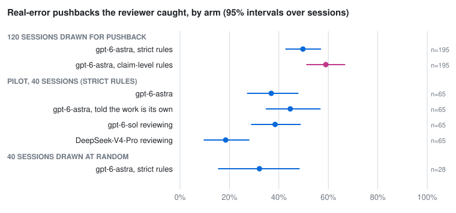
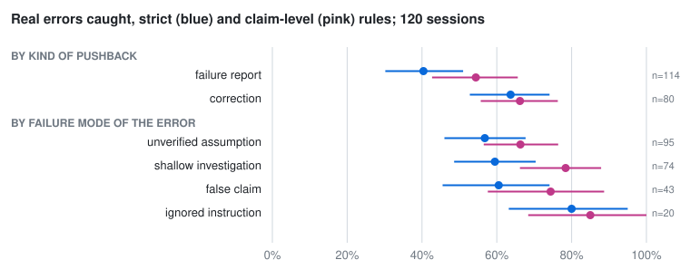

# Would an AI Reviewer Have Caught It? Automated Review Against Real Developer Pushback on Coding-Agent Work

*Draft, 10-03. Every number is provisional until the hand check of the merge
(section 3.7) is done. The study's working notes, assumptions and commands are in
`docs/study.md`; this draft is the paper built from them.*

## Abstract

Coding agents hand their work back to developers many times in a session, and
developers often push back: the fix does not work, the agent ignored part of
the request, or it claimed something it never checked. A common proposal is to
put an AI reviewer between the agent and the developer. We ask whether such a
reviewer would have flagged the problem the developer then raised.

We study 1,246 handbacks in 120 real sessions from SWE-chat. At each handback, a
reviewer reads the agent's work and lists the problems a careful developer would
push back on. It never sees the developer's reply. Separately, every developer
reply is classified as pushback or not, following SWE-chat's own codebook. A
third model then matches each pushback against the reviewer's problems, and
every match must quote both sides.

The reviewer names the developer's problem for 28% [24–33] of all pushbacks and
for 50% [43–57] of pushbacks about real agent errors. Among real errors, it
catches 80% of ignored instructions and 60% of false claims, but only 40% of
failure reports, which describe what happened when the developer ran the
software. Often it had flagged the very claim the developer found false, but
only as unverified. Counting those as caught raises the share for real errors
to 59% [51–67]. A hand check of 60 pushbacks, including all 20 on which the two
readings disagree, will measure which matches a person. The reviewer also raises
1.8 problems per handback. 92% of them match no pushback as the same fault,
though a quarter of those were judged related to one.

A second GPT-6 reviewer gives the same picture, and so does a second matching
model (κ = 0.87 on which pushbacks were caught). A reviewer from another model
family, DeepSeek-V4-Pro, catches half as many. Telling the reviewer the work is
its own catches somewhat more (45% of real errors against 37%, on the same
pushbacks), while it also raises more problems. In sessions drawn without regard
to pushback, it catches 32% [15–48].

## 1. Introduction

Developers using coding agents work in a loop: they ask, the agent works and
reports, and they reply. Many replies are pushback. In 40 Claude Code sessions
drawn at random from SWE-chat, a public dataset of real sessions [SWE-chat],
38% of handbacks drew pushback by our reading. Tang et al. label 22.58% of failure
episodes as the agent misreporting its own work [Tang]. Transluce finds
"overselling" in 34.7% of SWE-chat sessions [Transluce].

One answer is to review the agent's work before the developer sees it, with a
monitor, a judge or the agent's own self-review. Vendors already report such
reviewers in system cards [GPT-6 Astra; Claude system cards]. Code review bots
are deployed on pull requests at scale [Cihan; AI-to-AI].

What has not been measured is whether such a reviewer catches what developers
actually catch. Benchmarks of honest reporting build their scenarios
[OverclaimBench; ImpossibleBench]. Observational studies label failures after
the fact, without asking whether a reviewer present at the moment would have
seen them [Tang; Plans]. Studies of code review compare LLM comments with human
comments on pull requests [Crupi; c-CRAB], not on an agent's handbacks within a
session.

Real sessions hold a natural experiment. At each handback, the agent's work is
fixed. The developer's next message records what a person who knew the task,
had the environment and often ran the software objected to. An automated
reviewer can be put at the same moment, shown the same work, and kept from
seeing the reply. Comparing the two answers a direct question: at the moment
an agent hands work back, would an AI reviewer have flagged what the developer
then raised?

We ask four questions:
- **RQ1.** How often does the reviewer name the problem the developer raised?
- **RQ2.** Which problems does it catch, and which does it miss?
- **RQ3.** What does the reviewer raise that developers do not?
- **RQ4.** Do the answers hold across reviewer models, a self-review framing,
  the model that matches the two, and the way sessions are sampled?

Our contributions:
1. **A method** that puts an automated reviewer at each handback of a real
   session, blind to the developer's reply. It builds the two lists
   independently and matches them with quotes checked on both sides.
2. **A reconstruction of who spoke in SWE-chat.** Of the rows SWE-chat files as
   user prompts, the developer typed only 68% in our pushback-drawn sessions,
   and 54% in random ones. Each error moves a handback boundary and invents or
   loses a reply, so we decide each row from the session's raw transcript.
3. **Results.** A transcript-reading reviewer catches about half of the
   developer's real-error pushbacks, across the failure modes the transcript
   can show, and ignored instructions most. It misses most of what only
   running the software shows, and raises many problems developers never
   raise.
4. **Code and run data** for every number, with 86 checks of the method's rules
   (72 rules broken one at a time, each caught by a check). There is also a
   hand-check protocol that weighs a stratified sample back to the whole.

## 2. Related work

**Real developer–agent sessions.** SWE-chat collects coding-agent sessions from
public repositories through the Entire CLI, with transcripts, tool calls and
labels of developer pushback [SWE-chat]. Tang et al. analyse 20,574 sessions
and define each failure episode by the developer's pushback. "Inaccurate
self-reporting" is 22.58% of episodes [Tang]. SWE-Together replays SWE-chat
sessions as interactive tasks from their first request [SWE-Together].
errata-bench, our earlier work, rebuilds the moment of a real pushback and
reruns new agents there [errata-bench]. None of these asks whether an automated
reviewer at the handback would have flagged the developer's problem.

**Judging agent transcripts.** Transluce ran an LLM judge over 4,990 SWE-chat
sessions and found "overselling" in 34.7% of them [Transluce]. Its verdicts are
spot-checked, not compared with what developers objected to. "Plans They
Abandon, Reports They Author" tried an LLM adjudicator for unsupported claims in
SWE-chat reports. It agreed with hand coding at κ = 0.185, so the authors drew
no conclusion from it [Plans]. RealClawBench finds that an auditor shown the
execution evidence agrees with people at κ = 0.748, against 0.128 when it sees
only the final output [RealClawBench]. Our reviewer therefore sees the agent's
calls and results, not only its report. Advani finds that no judge configuration
detects false success well from stored trajectories [Advani]. Studies of claim
reliability compare agent claims with code and history: in one developer's
codebase [Leith], and in pull-request descriptions [Gong].

**Human and automated code review.** In code review, "pushback" names a
reviewer blocking a change, studied at Google through developers' negative
feelings about review [Egelman]. LLM reviewers are now deployed in industry. At
Beko, 73.8% of an LLM tool's comments were resolved, while pull requests took
longer to close [Cihan]. A mixed open- and closed-source case study found 8.1% of
LLM comments accepted [TSE case study]. Closest to our question, Crupi et al.
asked whether ChatGPT recommends the same quality improvements as human
reviewers on the same 179 pull requests [Crupi]. c-CRAB turns human reviews into
tests, and finds that review agents together pass about 40% and often attend to
other aspects than humans [c-CRAB]. AI reviewers increasingly review AI-authored
pull requests [AI-to-AI]. In peer review, GPT-4's comments overlap a human
reviewer's about as much as two humans' overlap (30.85% against 28.58%) [Liang].
We bring this comparison to the agent's own handbacks, where the developer's
reply is the human review.

## 3. Study design

### 3.1 Data

We use SWE-chat's first release: 5,851 sessions from 205 public repositories,
mostly Claude Code [SWE-chat]. Its raw transcripts are kept as well.

**Pushback-drawn sessions** (main sample). We draw sessions with at least one
developer reply that an earlier reading had judged a pushback about a real agent
error, at most two from any repository. The order is shuffled with a fixed seed.
The pilot takes the first 40, and a second batch the next 80 that no other
study run held: 120 sessions from 86 repositories. 112 have a raw transcript.
By agent: 112 Claude Code, 6 OpenCode, 1 Copilot CLI and 1 Cursor.

**Random sessions** (comparison arm). We draw 40 Claude Code sessions without
regard to pushback: sessions with at least two developer prompts and a raw
transcript, at most two from any repository, and none already in another arm.
That gives 40 sessions from 33 repositories.

**Handbacks.** A handback (or report) is the agent's work between two developer
messages, ending with its report. Each session contributes at most its first 40
handbacks, which trims 6 of the 120 sessions. The pushback-drawn sample has
1,246 handbacks, and the random sample 308.

### 3.2 Who spoke

A handback ends wherever the developer speaks, so the study depends on knowing
which rows the developer typed. SWE-chat files much under `user_prompt` that the
developer never wrote. In the 112 pushback-drawn sessions with a transcript, the
developer typed 1,629 of 2,386 such rows (68%); in the 40 random sessions, 307 of
572 (54%). Rules on the table alone, dropping notices, compaction summaries and
teammate messages by their opening words, keep 1,930. The transcript's rules keep
301 fewer of them (16%): they drop copies the logger re-inserts later, expanded
commands and skills, and scheduled prompts.

We therefore decide each row from the raw transcript. A row is the developer's
if it matches, in order, a prompt the transcript records as typed (each typed
entry used once), or is one of:
- a slash command;
- a message queued while the agent worked;
- a tool call the developer refused, with any words they gave.

Teammate agents' messages, compaction summaries, notices, tool output, copies,
and timed or scheduled prompts are never the developer's. For the eight sessions
without a transcript, the table's rules decide. Two independent reviews read
this logic before any large run. Every defect they found was fixed, with a
check that fails when the fix is undone.

### 3.3 Thread A: the reviewer

At each handback, the reviewer reads a window:
- the session's first developer message (the task, up to 6,000 characters);
- the agent's previous message (4,000);
- the developer's current request (8,000);
- everything the agent did after it: messages, tool calls and results (60,000).

Each tool input and result is cut to 4,000 characters, less if needed to fit,
and every cut is marked. The agent's hidden reasoning is left out, since the
developer did not see it. On the pilot, the median window is 11,242 characters,
where the whole history before a handback has a median of 187,000 tokens.

The reviewer lists every problem a careful developer would push back on before
accepting the work. Each problem has a short description, a kind (for example
false claim, unverified assumption, ignored instruction) and a verbatim quote
from the agent's work. A problem counts only if its quote is found in the work
after the request: a problem in earlier work was judged at its own handback. An
empty list is allowed. The reviewer never sees the developer's reply.

### 3.4 Thread B: the developer

Every developer reply is classified independently of thread A, following
SWE-chat's codebook: correction, rejection, failure report, takeover, or not
pushback [SWE-chat]. For pushback, the classifier also records what the
developer objects to: a real agent error, an unwanted but defensible choice, a
preference, or unclear. It also records the error's failure mode, with quotes
from the reply. An approved plan is never pushback. SWE-chat's own label is kept
beside our reading. The two agree at κ = 0.52; ours is stricter, and most
replies SWE-chat calls pushback and we do not are new requests or questions.

### 3.5 The merge

Each pushback in reply k is compared with every problem the reviewer raised at
handbacks k-2, k-1 and k. Developers often object a turn or two after the work,
once they have tried it. The matcher gives each problem one of three verdicts:
- **same:** it names the developer's fault, in the same piece of work;
- **related:** the same work, or a cause or symptom, but not the fault;
- **different.**

A 'same' counts only if the matcher quotes the overlap from both the reply and
the problem, and both quotes are found. A pushback is **caught** if any problem
is a valid 'same'. A problem matched by no pushback is the reviewer's alone.

The line between 'same' and 'related' is drawn two ways.
- **Strict** (rules version 1): the definitions above.
- **Claim-level** (rules version 2): the definitions plus the hand-check
  guide's two worked examples. In the first, a reviewer that said "claims the
  tests pass but never ran them" caught a developer who said "the tests still
  fail": the reviewer flagged the very claim the developer found false. In the
  second, "the click handler was not tested on touch devices" is only related
  to "the button does nothing on mobile".

All runs used the strict rules. The 195 real-error pushbacks were merged again
under the claim-level rules.

### 3.6 Measures and statistics

The main measure is the share of pushbacks about real errors that were caught.
We also report the share of all pushbacks, and shares by kind and failure mode.
Pushbacks whose merge did not complete are left out, not counted as missed.
Every share has a 95% interval from 2,000 bootstrap resamples of whole sessions,
since moments within a session are not independent. Agreement is Cohen's κ.

All models are run on Azure: gpt-6-astra for the reviewer, the classifier and
the matcher unless stated. The sessions were written mostly by Claude models,
so the reviewer is never the agent that did the work.

### 3.7 Validation of the merge

The match is the study's measuring instrument, so it is checked twice.
- **By hand** (pending). One author calls 60 real-error pushbacks, blind to
  the merge. Each item shows the reply and every problem the reviewer raised
  before it, and the author says which problems, if any, name the
  developer's fault. The sample is stratified by the merge's outcome:
  - all 20 pushbacks the two readings decide differently;
  - 20 of the 96 both call caught;
  - 20 of the 73 neither does;
  - the 6 with no problem to compare count as not caught.

  Weighing each stratum back to its size gives the share of real errors caught
  by the author's calls. The interval is exact: each sampled stratum's uncalled
  pushbacks follow a Beta-binomial on its calls (a Jeffreys prior), convolved
  over the strata. The analysis has three steps, in order:
  - the author's share is the headline;
  - the disputed 20, the only pushbacks the two readings decide differently,
    pick the reading, with an exact sign test;
  - the picked reading's figures are used if its share is within 10 points of
    the author's at 95%. That is about the resolution 60 calls allow.

  κ is reported with an exact interval, not as the rule. Nothing is shown
  until all 60 are called, so the author cannot learn an item's stratum while
  labelling.

  The guide gives both the author and the merge the claim-level rules' worked
  examples: it is the study's definition of 'same'. Agreement with the
  claim-level reading is therefore partly built in, and the hand check tests
  whether each reading applies the definition as a person does.

  The author also calls 50 of the reviewer's unmatched problems real, false
  alarm or can't tell. The protocol is in `docs/study.md`.

  Three earlier designs were dropped before any labelling.
  - A uniform sample of single merge decisions: most are plainly 'different',
    so its κ could pass with every 'same' wrong.
  - A κ ≥ 0.7 rule on this sample: it would pass the strict reading at κ 0.80
    even if the author agreed exactly with the claim-level reading, 9 points
    away.
  - Accepting a reading whenever the interval of its gap held 0: it caught a
    5-point gap about a third of the time, and could contradict the sign
    test.
- **By a second model:** gpt-6-sol re-matches the pilot's 252 pushbacks on the
  same inputs (section 4.4).

## 4. Results

### 4.1 RQ1: how often does the reviewer name the developer's problem?

*Figure 1. Real-error pushbacks the reviewer caught, by arm, with 95% intervals
over sessions (`scripts/study_figures.py`).*

| | Pushback-drawn, 120 sessions |
|---|---|
| Handbacks | 1,246 |
| Pushbacks (our reading) | 530 |
| Caught, all pushbacks | 28.3% [24–33] |
| **Caught, real errors** | **49.7% [43–57]**, n = 195 |
| Caught, real errors, claim-level rules | 59.0% [51–67] |
| Caught, pushback by SWE-chat's label | 21.8% [19–26], n = 669 |
| Caught, both readings say pushback | 29.2% [24–35], n = 428 |
| 'Same' or 'related', real errors | 84.6% [78–90] |

The reviewer names the developer's fault for half of the real-error pushbacks
under the strict rules, and for 59% under the claim-level rules. The claim-level
rules turn 19 'related' pushbacks into 'same', and one the other way. The two
readings agree on caught or not at κ = 0.80. Counting 'related' as well says
little: the reviewer flags 78% of all handbacks, so it usually has something to
say about any handback a developer objects to.

Three quarters of the catches (112 of 150) come from the reviewer's problems at
the handback the developer answered. Counting only those gives 39% [33–47] of
real errors; one handback back gives 46%, and two give 50%.

### 4.2 RQ2: which problems does it catch, and which does it miss?

*Figure 2. Real errors caught by kind of pushback and failure mode, under the
strict (blue) and claim-level (pink) rules.*

| Kind of pushback | Caught, all pushbacks | Caught, real errors | Real errors, claim-level |
|---|---|---|---|
| Correction | 34.7% [29–40], n = 271 | 64% [53–74], n = 80 | 66% [56–76] |
| Failure report | 23.5% [17–30], n = 230 | 40% [30–51], n = 114 | 54% [43–66] |
| Rejection | 6.9% [0–17], n = 29 | n = 1 | |

| Failure mode of the real error | Caught | Claim-level | n |
|---|---|---|---|
| Ignored instruction | 80% [63–95] | 85% [68–100] | 20 |
| False claim | 60% [45–74] | 74% [58–89] | 43 |
| Shallow investigation | 59% [49–70] | 78% [66–88] | 74 |
| Unverified assumption | 57% [46–68] | 66% [56–76] | 95 |

A real error can have more than one failure mode.

| By what the developer objects to | Caught | n |
|---|---|---|
| Real error | 49.7% [43–57] | 195 |
| Unwanted but defensible | 21.7% [15–29] | 143 |
| Preference | 11.8% [0–28] | 17 |
| Unclear | 11.4% [7–17] | 175 |

Ignored instructions stand out (80%). False claims, shallow investigation and
unverified assumptions are caught at similar rates (57–60%). The reviewer does
worst on failure reports, where the developer describes what happened when they
ran the software. The claim-level rules close much of that gap (40% to 54%).
For a failure report, the reviewer often could not know the fault, but it had
flagged the claim of success as unverified.

From a preliminary reading of 16 of the pilot's 36 real-error pushbacks that
both framings missed (not yet checked by the authors):
- Most are outcomes only someone running the software sees: "the panel opens
  but it is blank", "the build still fails", "the import still returns a 404".
  In many, the reviewer flagged the same handback for not verifying its fix
  ('related'), but could not know the fault.
- The rest need context only the developer has: the project's norms ("why was
  PR #45 merged without my approval"), their environment ("the API key is
  already in your .env"), or an image the reviewer cannot see.

### 4.3 RQ3: what does the reviewer raise that developers do not?

The reviewer raises 1.79 problems per handback and flags 78% [75–81] of
handbacks. Of its 2,232 problems, 2,052 (92%) match no pushback as the same
fault:
- 565 were judged related to one;
- 263 had no pushback within two handbacks to compare with;
- 1,224 were judged different from every pushback they were compared with.

By kind, its
problems are unverified assumptions (30%), other (18%), shallow investigation
(17%), false claims (15%) and ignored instructions (11%).

An unmatched problem is either a real problem the developer let pass, or did not
notice yet, or a false alarm. Developers do not reply to every flaw, so the
developer's silence is not a label. The hand check of 50 unmatched problems
(pending) will estimate the split.

### 4.4 RQ4: robustness

| | Pilot, gpt-6-astra | Pilot, self framing | Pilot, gpt-6-sol reviewer | Pilot, DeepSeek-V4-Pro reviewer | Random sessions |
|---|---|---|---|---|---|
| Handbacks | 402 | 402 | 402 | 402 | 308 |
| Pushbacks | 180 | 180 | 180 | 180 | 117 |
| Caught, all pushbacks | 22.8% [16–29] | 27.8% [21–34] | 26.7% [21–31] | 13.9% [9–19] | 18.8% [12–29] |
| Caught, real errors | 36.9% [27–48] | 44.6% [35–57] | 38.5% [29–49] | 18.5% [10–28] | 32.1% [15–48] (n = 28) |
| Problems per handback | 1.83 | 2.01 | 2.28 | 2.15 | 1.88 |
| Handbacks flagged | 77% | 80% | 83% | 66% | 79% |
| Problems unmatched | 93% | 93% | 93% | 96% | 94% |

**Reviewer model.** A second GPT-6 reviewer, gpt-6-sol, gives the same
picture: 38% of real errors. DeepSeek-V4-Pro, from another family, catches half
as many: 18% [10–28]. On the same 65 real errors, 10 are caught by both, 14 by
gpt-6-astra only and 2 by DeepSeek only. DeepSeek raises as many problems, but
flags fewer handbacks.

Part of the gap may lie in the matching, not the reviewing.
- In one case we read, both reviewers flagged the same unverified claim in
  nearly the same words. gpt-6-astra's wrote "claims processes now appear
  without checking ... does not establish a fix for an empty list". DeepSeek's
  wrote "claims 'Processes Now Showing' but never verified that processes
  actually appear". The strict merge called the first 'same' and the second
  'related' (section 3.5): the strict line is applied unevenly.
- We did not measure how often this happens. Merging DeepSeek's real errors
  under the claim-level rules would.
- The matching model is also a GPT-6 model, and might favour its own family's
  wording.

Either way, which reviewer is used changes how much it catches.

**Self framing.** The same model is told the work is its own. On the same 180
pushbacks, 38 are caught by both framings, 12 by the self framing only and 3 by
the outside framing only (exact binomial on the 15 discordant pairs, p ≈ 0.035,
not adjusted for sessions). On real errors: 24 both, 5 self only, 0 outside only
(p = 0.0625). The self framing also raises more problems (2.01 against 1.83 per
handback), so part of its gain may be volume.

**Matching model.** gpt-6-sol re-matched the pilot's pushbacks on the same
inputs. The two models agree on whether a pushback was caught for 95% of
pushbacks (κ = 0.87) and 64 of 65 real errors (κ = 0.97). On each candidate's
verdict they agree 89% (κ = 0.75; κ = 0.86 for 'same' against the rest).

**Sampling.** In sessions drawn without regard to pushback, the reviewer catches
32% [15–48] of real errors. The interval is wide: random sessions hold few
real-error pushbacks (28 in 40 sessions).

**Batches.** The pilot caught 37% [27–48] of its 65 real errors, and the second
batch 56% [47–65] of its 130.
- The two are random draws from one shuffled pool, processed by the same code
  and model.
- Their mix of failure modes, agents and developer personas is alike.
- A gap this large arises by chance about 1 time in 55 (shuffling whole
  sessions between the batches, p = 0.018), by a test chosen after the gap was
  seen.

- The pilot's 40 sessions were the development set: the rules for who spoke
  were fixed while preparing exactly those sessions. That is a candidate
  explanation we have not tested.

We found no other processing difference, so we report the pooled figure, whose
interval resamples sessions.

## 5. Discussion

**What a transcript-reading reviewer can and cannot do.** Half or more of
developers' real-error pushbacks were visible in the transcript, and the
reviewer found them: claims the agent's own calls do not support, and parts of
the request it skipped. A reviewer like this could raise them before the
developer has to.

For failure reports, the reviewer often could not know what would go wrong. But
it had flagged the agent's claim of success as unverified, and that warning
alone would have sent a developer to check. The rest need running the software,
or facts only the developer has. A reviewer that runs the code, or asks the
developer, would be needed for those. We did not test one.

**The reviewer says much more than developers do.** At 1.8 problems per
handback, a developer shown every flag would read many that no developer raised.
Whether these are problems developers miss or noise decides whether such a
reviewer helps or adds review load. This is the hand check's second question.

**Self-review.** Telling the reviewer the work is its own made it catch somewhat
more, not less, while it also raised more problems. We cannot test the original agent reviewing itself, since the sessions'
agents were mostly Claude models we did not run. The framing is the closest
proxy we have.

**Comparison with other measures of AI review.** The reviewer catches about a
quarter of all pushbacks. That is near the overlap of an LLM with a human
reviewer in peer review [Liang], and below the 40% c-CRAB reports for review
agents against human pull-request reviews [c-CRAB]. The settings differ, so this
is context, not a ranking.

## 6. Threats to validity

- **The match is a model's.** Two matching models agree (κ = 0.87), but they
  could share a blind spot. The hand check is the test. The author's share is
  the headline, and the merge's figures are used only within 10 points of it.
  A 60-pushback check resolves no finer.
- **One coder.** The hand check is one author's. A second coder would give the
  agreement between people, which bounds how well any merge can do.
- **Where 'same' ends.** Whether flagging the claim the developer found false
  as unverified counts as catching the fault moves the main measure by 9
  points (50% against 59%). We report both readings until the hand check's
  20 disputed pushbacks settle which matches a person.
- **Pushback and real error are a model's reading.** It agrees with SWE-chat's
  label at κ = 0.52 and is stricter. The main measure counts only real errors,
  and we also report every share under SWE-chat's label.
- **The developer's reply is an incomplete label.** Developers do not raise
  every flaw, and may raise one a turn later than the work. The two-handback
  look-back covers the second. The first is why unmatched problems are not
  called false alarms.
- **Selection.** The main sample is drawn for having a real-error pushback. The
  random arm estimates the general rate, with a wide interval.
- **What the reviewer sees.** A window, not the whole history. The reviewer can
  miss something said many turns earlier, which the developer remembers.
- **One dataset.** SWE-chat's sessions are public repositories, mostly Claude
  Code, from early 2026. The reviewers are OpenAI and DeepSeek models.
- **Data contamination.** SWE-chat is public, and the reviewer models may have
  seen it. The reviewer sees only the work before the reply, which limits what
  memory of a session could add.

## 7. Conclusion

At the moment a coding agent hands its work back, an AI reviewer reading the
transcript would have named the developer's problem for half to three fifths of
the pushbacks about real errors (50–59%, depending on where 'same' ends), and
about a quarter of all pushbacks. How much it catches depends on the reviewer
model. It catches what the transcript shows, ignored instructions most. It
misses what only running the software or knowing the project shows. It also
raises many problems no developer raised. The developer's reply makes these
numbers possible: real sessions record what a person who cared about the
outcome actually objected to.

## References (to be formatted)

- [SWE-chat] SWE-chat: Coding Agent Interactions From Real Users in the Wild. arXiv:2604.20779.
- [Tang] Tang et al. How Coding Agents Fail Their Users: A Large-Scale Analysis of Developer-Agent Misalignment in 20,574 Real-World Sessions. arXiv:2605.29442.
- [Transluce] Zhang and the Docent team. Measuring coding agent misalignment in the wild. Transluce, 4 August 2026. https://transluce.org/docent/blog/coding-agent-behaviors
- [Plans] Kraishan and Jitkajornwanich. Plans They Abandon, Reports They Author. arXiv:2609.12205.
- [SWE-Together] Wu et al. SWE-Together: Evaluating Coding Agents in Interactive User Sessions. arXiv:2606.29957.
- [RealClawBench] Lv et al. RealClawBench: Live OpenClaw Benchmarks from Real Developer-Agent Sessions. arXiv:2606.03889.
- [Advani] Advani. From Confident Closing to Silent Failure: Characterizing False Success in LLM Agents. arXiv:2606.09863.
- [Leith] Leith. Between the Commits: Process, Error, and Claim Reliability in a Wholly AI-Authored Codebase. arXiv:2609.29744.
- [Gong] Gong et al. Analyzing Message-Code Inconsistency in AI Coding Agent-Authored Pull Requests. arXiv:2601.04886.
- [OverclaimBench] Smyth et al. Quantifying Overclaiming Propensity in Frontier LLM Agents. arXiv:2609.20812.
- [ImpossibleBench] Zhong, Raghunathan and Carlini. ImpossibleBench. arXiv:2510.20270.
- [Egelman] Egelman et al. Predicting developers' negative feelings about code review. ICSE 2020, 174–185.
- [Cihan] Cihan et al. Automated Code Review In Practice. arXiv:2412.18531 (ICSE SEIP 2025).
- [TSE case study] Impact of an LLM-based Review Assistant in Practice: A Mixed Open-/Closed-source Case Study. IEEE TSE (early access). Authors to be added.
- [Crupi] Crupi, Tufano and Bavota. Studying Quality Improvements Recommended via Manual and Automated Code Review. arXiv:2602.11925.
- [c-CRAB] Zhang et al. Code Review Agent Benchmark. arXiv:2603.23448.
- [AI-to-AI] Selvanayagam and Ghaleb. AI-to-AI Code Reviews of GitHub Pull Requests. arXiv:2608.21311.
- [Liang] Liang et al. Can large language models provide useful feedback on research papers? A large-scale empirical analysis. NEJM AI, 2024 (arXiv:2310.01783).
- [GPT-6 Astra] OpenAI. GPT-6 Astra system card, §8.3.1.
- [Claude system cards] Anthropic. Claude Opus 4.8 system card §6.3.6.2; Claude Fable 5 / Mythos 5 system card §6.3.5.2.
- [errata-bench] errata-bench v1.0. https://github.com/zanwenfu/errata-bench
